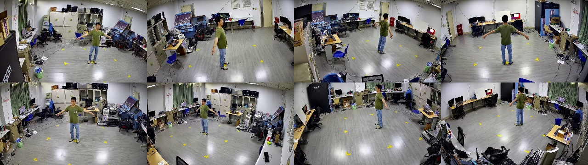
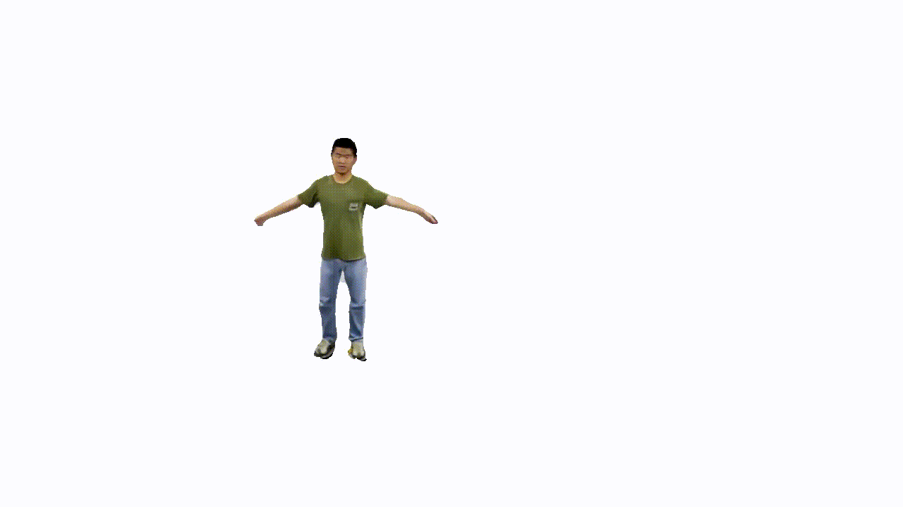

<!--
 * @Date: 2021-01-13 20:32:12
 * @Author: Qing Shuai
 * @LastEditors: Qing Shuai
 * @LastEditTime: 2021-06-28 14:08:02
 * @FilePath: /EasyMocapRelease/Readme.md
-->

# EasyMocap

**EasyMocap** is an open-source toolbox for **markerless human motion capture** from RGB videos. In this project, we provide a lot of motion capture demos in different settings.


---

## Core features

### Multiple views of a single person

[](./doc/quickstart.md)

This is the basic code for fitting SMPL[1]/SMPL+H[2]/SMPL-X[3]/MANO[2] model to capture body+hand+face poses from multiple views.

<div align="center">
    
    <br>
    <sup>Videos are from ZJU-MoCap, with 23 calibrated and synchronized cameras.<sup/>
</div>

<div align="center">
    
    <br>
    <sup>Captured with 8 cameras.<sup/>
</div>

### Internet video with a mirror

[](https://arxiv.org/pdf/2104.00340.pdf) [](https://github.com/zju3dv/Mirrored-Human)

<div align="center">
    
    <br>
    <sup>The raw video is from <a href="https://www.youtube.com/watch?v=KOCJJ27hhIE">Youtube<a/>.<sup/>
</div>

<div align="center">
    <br/>
    <sup>Captured with 6 cameras and a mirror<sup/>
</div>

### Multiple Internet videos with a specific action (Coming soon)

[](https://arxiv.org/pdf/2008.07931.pdf) [](./doc/todo.md)

<div align="center">
    <br/>
    <sup>Internet videos of Roger Federer's serving<sup/>
</div>

### Multiple views of multiple people

[](https://arxiv.org/pdf/1901.04111.pdf) [](./doc/mvmp.md)

<div align="center">
    <br/>
    <sup>Captured with 8 consumer cameras<sup/>
</div>

### Novel view synthesis from sparse views
[](https://arxiv.org/pdf/2012.15838.pdf) [](https://github.com/zju3dv/neuralbody)

<div align="center">
    <br/>
    <br/>
    <sup>Captured with 8 consumer cameras<sup/>
</div>

## Other features

### 3D Realtime visualization
[](./doc/realtime_visualization.md)
<div align="center">
    
    
    
</div>

<div align="center">
    
    
    
</div>

### Other
- [Camera calibration](apps/calibration/Readme.md): a simple calibration tool based on OpenCV
- [Pose guided synchronization](./doc/todo.md) (comming soon)
- [Annotator](apps/annotation/Readme.md): a simple GUI annotator based on OpenCV
- [Exporting of multiple data formats(bvh, asf/amc, ...)](./doc/02_output.md)

## Updates

- 06/28/2021: The **Multi-view Multi-person** part is released!
- 06/10/2021: The **real-time 3D visualization** part is released!
- 04/11/2021: The calibration tool and the annotator are released.
- 04/11/2021: **Mirrored-Human** part is released.

## Installation

See [doc/install](./doc/installation.md) for more instructions.

## Evaluation

The weight parameters can be set according to your data.

More quantitative reports will be added in [doc/evaluation.md](doc/evaluation.md)

## Acknowledgements

Here are the great works this project is built upon:

- SMPL models and layer are from MPII [SMPL-X model](https://github.com/vchoutas/smplx).
- Some functions are borrowed from [SPIN](https://github.com/nkolot/SPIN), [VIBE](https://github.com/mkocabas/VIBE), [SMPLify-X](https://github.com/vchoutas/smplify-x)
- The method for fitting 3D skeleton and SMPL model is similar to [TotalCapture](http://www.cs.cmu.edu/~hanbyulj/totalcapture/), without using point clouds.
- We integrate some easy-to-use functions for previous great work:
  - `easymocap/estimator/SPIN`  : an SMPL estimator[5]
  - `easymocap/estimator/YOLOv4`: an object detector[6](Coming soon)
  - `easymocap/estimator/HRNet` : a 2D human pose estimator[7](Coming soon)

We also would like to thank Wenduo Feng, Di Huang, Yuji Chen, Hao Xu, Qing Shuai, Qi Fang, Ting Xie, Junting Dong, Sida Peng and Xiaopeng Ji who are the performers in the sample data.

## Contact

Please open an issue if you have any questions. We appreciate all contributions to improve our project.

## Citation

This project is a part of our work [iMocap](https://zju3dv.github.io/iMoCap/), [Mirrored-Human](https://zju3dv.github.io/Mirrored-Human/) and [Neural Body](https://zju3dv.github.io/neuralbody/)

Please consider citing these works if you find this repo is useful for your projects.

```bibtex
@inproceedings{dong2020motion,
  title={Motion capture from internet videos},
  author={Dong, Junting and Shuai, Qing and Zhang, Yuanqing and Liu, Xian and Zhou, Xiaowei and Bao, Hujun},
  booktitle={European Conference on Computer Vision},
  pages={210--227},
  year={2020},
  organization={Springer}
}

@inproceedings{peng2021neural,
  title={Neural Body: Implicit Neural Representations with Structured Latent Codes for Novel View Synthesis of Dynamic Humans},
  author={Peng, Sida and Zhang, Yuanqing and Xu, Yinghao and Wang, Qianqian and Shuai, Qing and Bao, Hujun and Zhou, Xiaowei},
  booktitle={CVPR},
  year={2021}
}

@inproceedings{fang2021mirrored,
  title={Reconstructing 3D Human Pose by Watching Humans in the Mirror},
  author={Fang, Qi and Shuai, Qing and Dong, Junting and Bao, Hujun and Zhou, Xiaowei},
  booktitle={CVPR},
  year={2021}
}
```

## Reference

```bash
[1] Loper, Matthew, et al. "SMPL: A skinned multi-person linear model." ACM transactions on graphics (TOG) 34.6 (2015): 1-16.
[2] Romero, Javier, Dimitrios Tzionas, and Michael J. Black. "Embodied hands: Modeling and capturing hands and bodies together." ACM Transactions on Graphics (ToG) 36.6 (2017): 1-17.
[3] Pavlakos, Georgios, et al. "Expressive body capture: 3d hands, face, and body from a single image." Proceedings of the IEEE/CVF Conference on Computer Vision and Pattern Recognition. 2019.
Bogo, Federica, et al. "Keep it SMPL: Automatic estimation of 3D human pose and shape from a single image." European conference on computer vision. Springer, Cham, 2016.
[4] Cao, Z., Hidalgo, G., Simon, T., Wei, S.E., Sheikh, Y.: Openpose: real-time multi-person 2d pose estimation using part affinity fields. arXiv preprint arXiv:1812.08008 (2018)
[5] Kolotouros, Nikos, et al. "Learning to reconstruct 3D human pose and shape via model-fitting in the loop." Proceedings of the IEEE/CVF International Conference on Computer Vision. 2019
[6] Bochkovskiy, Alexey, Chien-Yao Wang, and Hong-Yuan Mark Liao. "Yolov4: Optimal speed and accuracy of object detection." arXiv preprint arXiv:2004.10934 (2020).
[7] Sun, Ke, et al. "Deep high-resolution representation learning for human pose estimation." Proceedings of the IEEE/CVF Conference on Computer Vision and Pattern Recognition. 2019.
```
