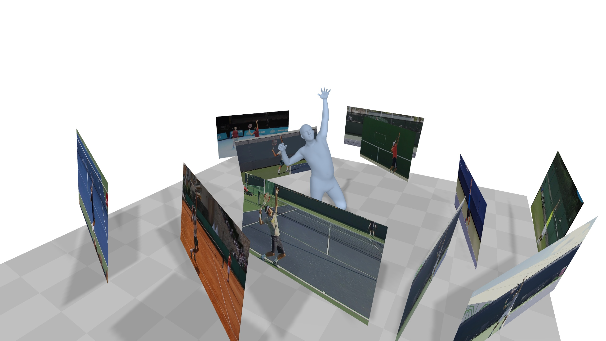

<!--
 * @Date: 2021-01-13 20:32:12
 * @Author: Qing Shuai
 * @LastEditors: Qing Shuai
 * @LastEditTime: 2021-04-02 12:26:56
 * @FilePath: /EasyMocapRelease/Readme.md
-->

# EasyMocap

**EasyMocap** is an open-source toolbox for **markerless human motion capture** from RGB videos. In this project, we provide a lot of motion capture demos in different settings.


----

## Core features

### Multiple views of single person

This is the basic code for fitting SMPL[1]/SMPL+H[2]/SMPL-X[3] model to capture body+hand+face poses from multiple views. 

<div align="center">
    
    <br>
    <sup>Videos are from ZJU-MoCap, with 23 calibrated and synchronized cameras.<sup/>
</div>

### Internet video with a mirror

[](https://arxiv.org/pdf/2104.00340.pdf)

<div align="center">
    
    <br>
    <sup>This video is from <a href="https://www.youtube.com/watch?v=KOCJJ27hhIE">Youtube<a/>.<sup/>
</div>

### Multiple Internet videos with a specific action (Coming soon)

[](https://arxiv.org/pdf/2008.07931.pdf)

<div align="center">
    
</div>

### Multiple views of multiple people (Comming soon)

[](https://arxiv.org/pdf/1901.04111.pdf)


### Others
This project is used by many other projects:
- [[CVPR21] Dense Reconstruction and View Synthesis from **Sparse Views**](https://zju3dv.github.io/neuralbody/)

## Other features

- [Camera calibration](./doc/todo.md)
- [Pose guided synchronization](./doc/todo.md)
- [Annotator](./doc/todo.md)
- [Exporting of multiple data formats(bvh, asf/amc, ...)](./doc/todo.md)

## Updates
- 04/02/2021: We are now rebuilding our project for `v0.2`, please stay tuned. `v0.1` is available at [this link](https://github.com/zju3dv/EasyMocap/releases/tag/v0.1).

## Installation

See [doc/install](./doc/install.md) for more instructions.

## Quick Start

See [doc/quickstart](doc/quickstart.md) for more instructions.

## Not Quick Start

See [doc/notquickstart](doc/notquickstart.md) for more instructions.

## Evaluation

The weight parameters can be set according your data.

More quantitative reports will  be added in [doc/evaluation.md](doc/evaluation.md)

## Acknowledgements

Here are the great works this project is built upon:

- SMPL models and layer are from MPII [SMPL-X model](https://github.com/vchoutas/smplx).
- Some functions are borrowed from [SPIN](https://github.com/nkolot/SPIN), [VIBE](https://github.com/mkocabas/VIBE), [SMPLify-X](https://github.com/vchoutas/smplify-x)
- The method for fitting 3D skeleton and SMPL model is similar to [TotalCapture](http://www.cs.cmu.edu/~hanbyulj/totalcapture/), without using point cloud.

We also would like to thank Wenduo Feng who is the performer in the sample data.

## Contact

Please open an issue if you have any questions. We appreciate all contributions to improve our project.

## Citation

This project is a part of our work [iMocap](https://zju3dv.github.io/iMoCap/), [Mirrored-Human](https://zju3dv.github.io/Mirrored-Human/) and [Neural Body](https://zju3dv.github.io/neuralbody/)

Please consider citing these works if you find this repo is useful for your projects.

```bibtex
@inproceedings{dong2020motion,
  title={Motion capture from internet videos},
  author={Dong, Junting and Shuai, Qing and Zhang, Yuanqing and Liu, Xian and Zhou, Xiaowei and Bao, Hujun},
  booktitle={European Conference on Computer Vision},
  pages={210--227},
  year={2020},
  organization={Springer}
}

@inproceedings{peng2021neural,
  title={Neural Body: Implicit Neural Representations with Structured Latent Codes for Novel View Synthesis of Dynamic Humans},
  author={Peng, Sida and Zhang, Yuanqing and Xu, Yinghao and Wang, Qianqian and Shuai, Qing and Bao, Hujun and Zhou, Xiaowei},
  booktitle={CVPR},
  year={2021}
}

@inproceedings{fang2021mirrored,
  title={Reconstructing 3D Human Pose by Watching Humans in the Mirror},
  author={Fang, Qi and Shuai, Qing and Dong, Junting and Bao, Hujun and Zhou, Xiaowei},
  booktitle={CVPR},
  year={2021}
}
```

## Reference
```bash
[1] Loper, Matthew, et al. "SMPL: A skinned multi-person linear model." ACM transactions on graphics (TOG) 34.6 (2015): 1-16.
[2] Romero, Javier, Dimitrios Tzionas, and Michael J. Black. "Embodied hands: Modeling and capturing hands and bodies together." ACM Transactions on Graphics (ToG) 36.6 (2017): 1-17.
[3] Pavlakos, Georgios, et al. "Expressive body capture: 3d hands, face, and body from a single image." Proceedings of the IEEE/CVF Conference on Computer Vision and Pattern Recognition. 2019.
Bogo, Federica, et al. "Keep it SMPL: Automatic estimation of 3D human pose and shape from a single image." European conference on computer vision. Springer, Cham, 2016.
[4] Cao, Z., Hidalgo, G., Simon, T., Wei, S.E., Sheikh, Y.: Openpose: real-time multi-person 2d pose estimation using part affinity fields. arXiv preprint arXiv:1812.08008 (2018)
```
