<!--
 * @Date: 2021-03-02 16:14:48
 * @Author: Qing Shuai
 * @LastEditors: Qing Shuai
 * @LastEditTime: 2021-03-27 21:56:34
 * @FilePath: /EasyMocap/scripts/calibration/Readme.md
-->
# Camera Calibration
Before reading this document, you should read the OpenCV-Python Tutorials of [Camera Calibration](https://docs.opencv.org/master/dc/dbb/tutorial_py_calibration.html) carefully.

## Some Tips
1. Use a chessboard as big as possible.
2. You must keep the same resolution during all the steps.

## 0. Prepare your chessboard

## 1. Record videos
Usually, we need to record two sets of videos, one for intrinsic parameters and one for extrinsic parameters.

First, you should record a video with your chessboard for each camera separately. The videos of each camera should be placed into the `<intri_data>/videos` directory. The following code will take the file name as the name of each camera.
```bash
<intri_data>
└── videos
    ├── 01.mp4
    ├── 02.mp4
    ├── ...
    └── xx.mp4
```

In this tutorial, we use our sample datasets as an example. In that dataset, the intri data is just like the picture below.

<div align="center">
    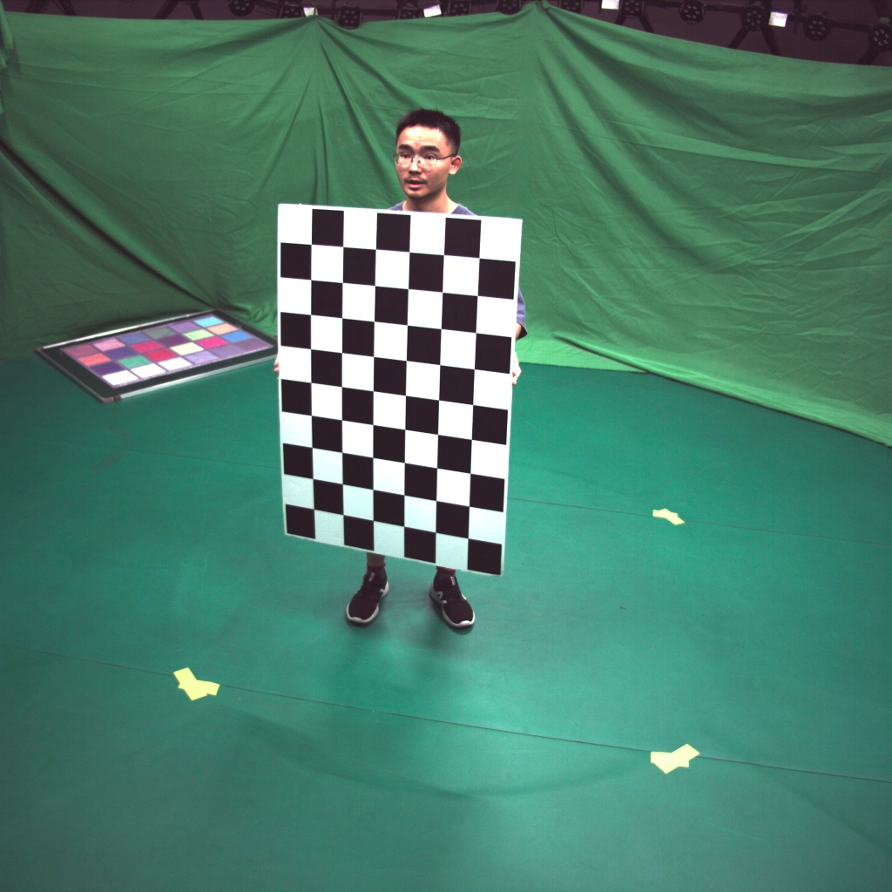
    <br>
    <sup>Example Intrinsic Dataset<sup/>
</div>


For the extrinsic parameters, you should place the chessboard pattern where it will be visible to all the cameras (on the floor for example) and then take a picture or a short video on all of the cameras.

```bash
<extri_data>
└── videos
    ├── 01.mp4
    ├── 02.mp4
    ├── ...
    └── xx.mp4
```

The sample extri data is like the picture below.


<div align="center">
    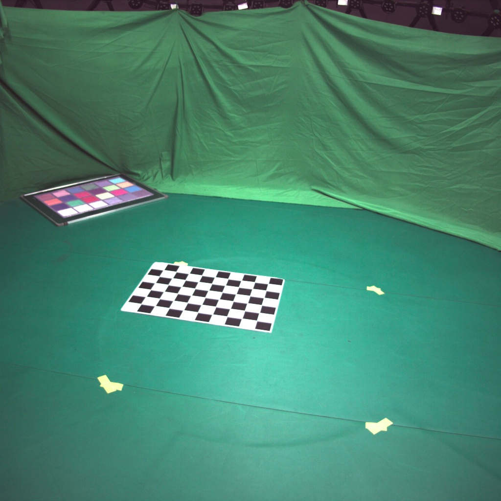
    <br>
    <sup>Example Extrinsic Dataset<sup/>
</div>


## 2. Detect the chessboard
For both intrinsic parameters and extrinsic parameters, we need detect the corners of the chessboard. So in this step, we first extract images from videos and second detect and write the corners.
```bash
# extract 2d
python3 scripts/preprocess/extract_video.py ${data} --no2d
# detect chessboard
python3 apps/calibration/detect_chessboard.py ${data} --out ${data}/output/calibration --pattern 9,6 --grid 0.1
```
The results will be saved in `${data}/chessboard`, the visualization will be saved in `${data}/output/calibration`.

To specify your chessboard, add the option `--pattern`, `--grid`.

Repeat this step for `<intri_data>` and `<extri_data>`.

After this step, you should get the results like the pictures below.

<div align="center">
    
    <br>
    <sup>Result of Detecting Extrinsic Dataset<sup/>
</div>


<div align="center">
    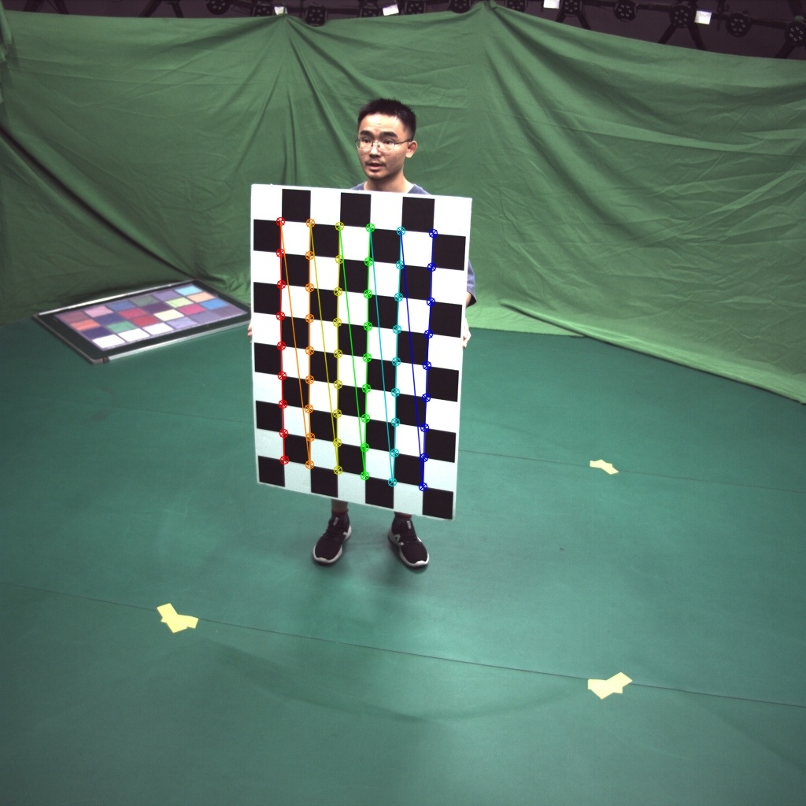
    <br>
    <sup>Result of Detecting Intrinsic Dataset<sup/>
</div>

## 2.5 Finetune the Chessboard Detection Result

It is vital for calibration to detect the keypoints of chessboard correctly. **Thus we highly recommend you to carefully inspect the visualization result in ${data}/output.** If you find some detection results are wrong, we provide you a tool to make some modifications to them.

```bash
python apps/annotation/annot_calib.py $data --mode chessboard --pattern 9,6 --annot chessboard
```

After running the script above, a OpenCV GUI prompt will show, like below:

<div align="center">
    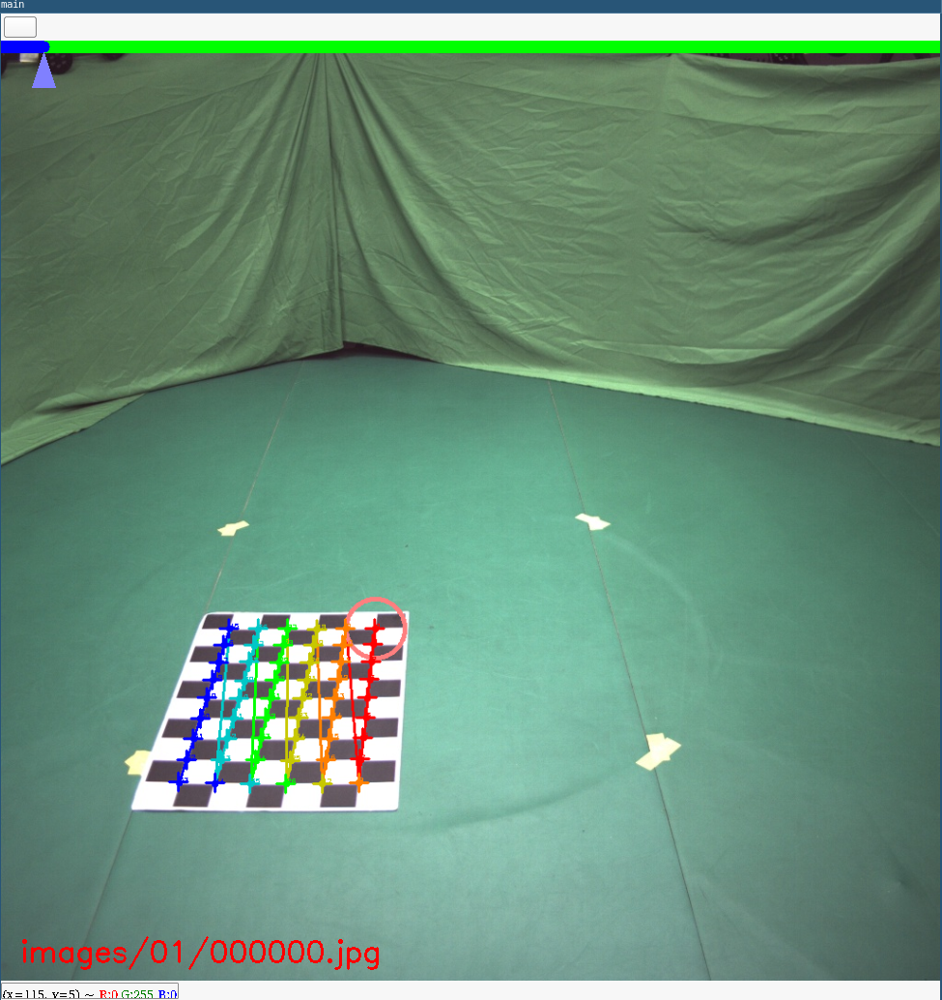
    <br>
    <sup>Calibration Annotation Toolkit GUI Interface<sup/>
</div>


> This tool is component of our awesome annotation toolkits, so some key mapping is similar. To learn more about our annotation tools, please check [the document](../annotation/Readme.md).

At the same time, you can see that the CLI presents some auxilary information.


<div align="center">
    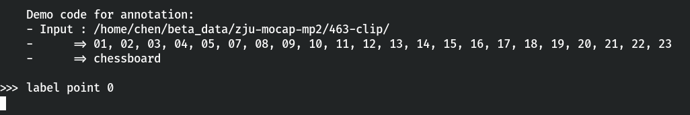
    <br>
    <sup>CLI Prompt of the Annotation Tool<sup/>
</div>


You can learn from the CLI prompt to know the information and which point you are labeling.

In the GUI, the current edited corner is highlighted by a red circle. If you want to make some modification, use mouse to click the correct place, and then a white anchor "+" is presented there.


<div align="center">
    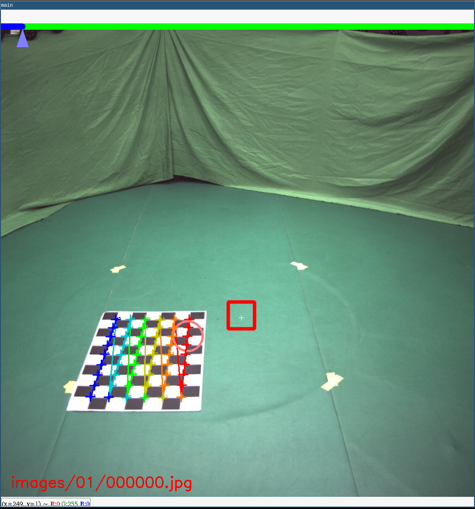
    <br>
    <sup>Use mouse to specify the correct position<sup/>
</div>

If you think the newly specified coordinate(marked as white anchor) should be the correct position for this corner, rather than old one, press `Space` to confirm. Then the corner position will be changed. 

<div align="center">
    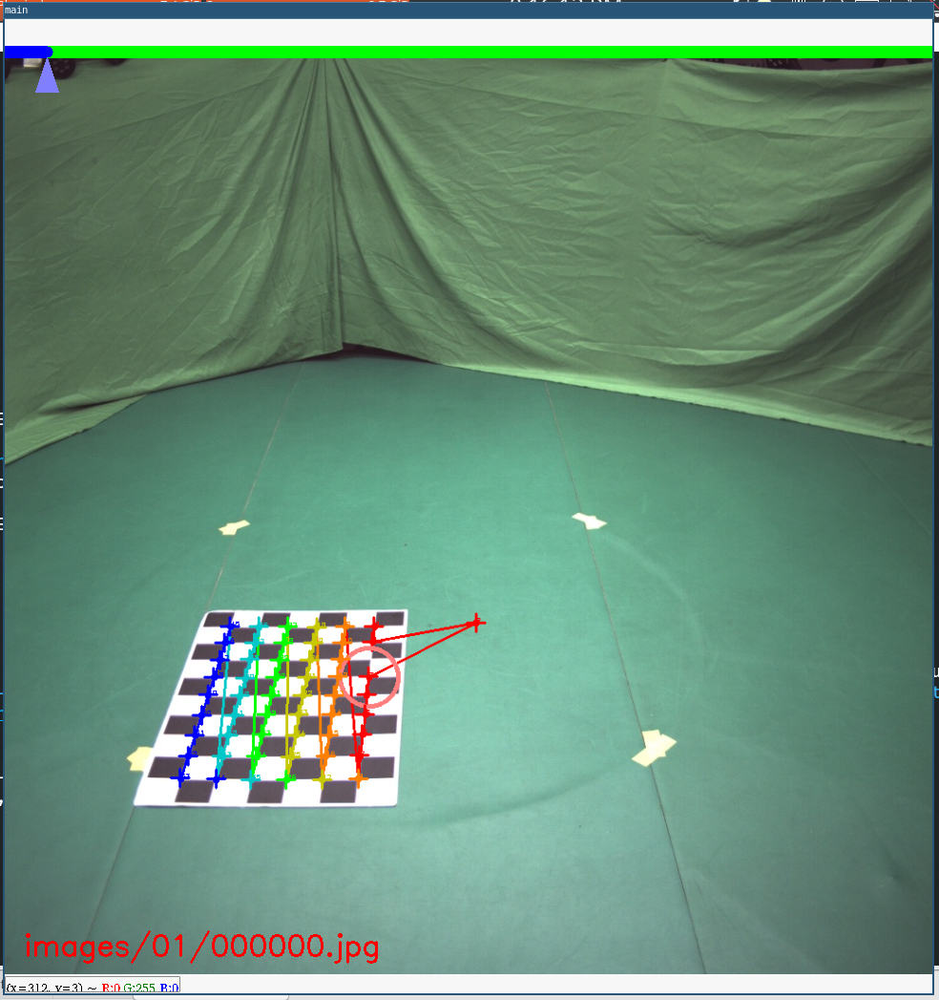
    <br>
    <sup>The result after modifing the position of point<sup/>
</div>

After finish modifying this point, press `Space` to move on to next point.


<div align="center">
    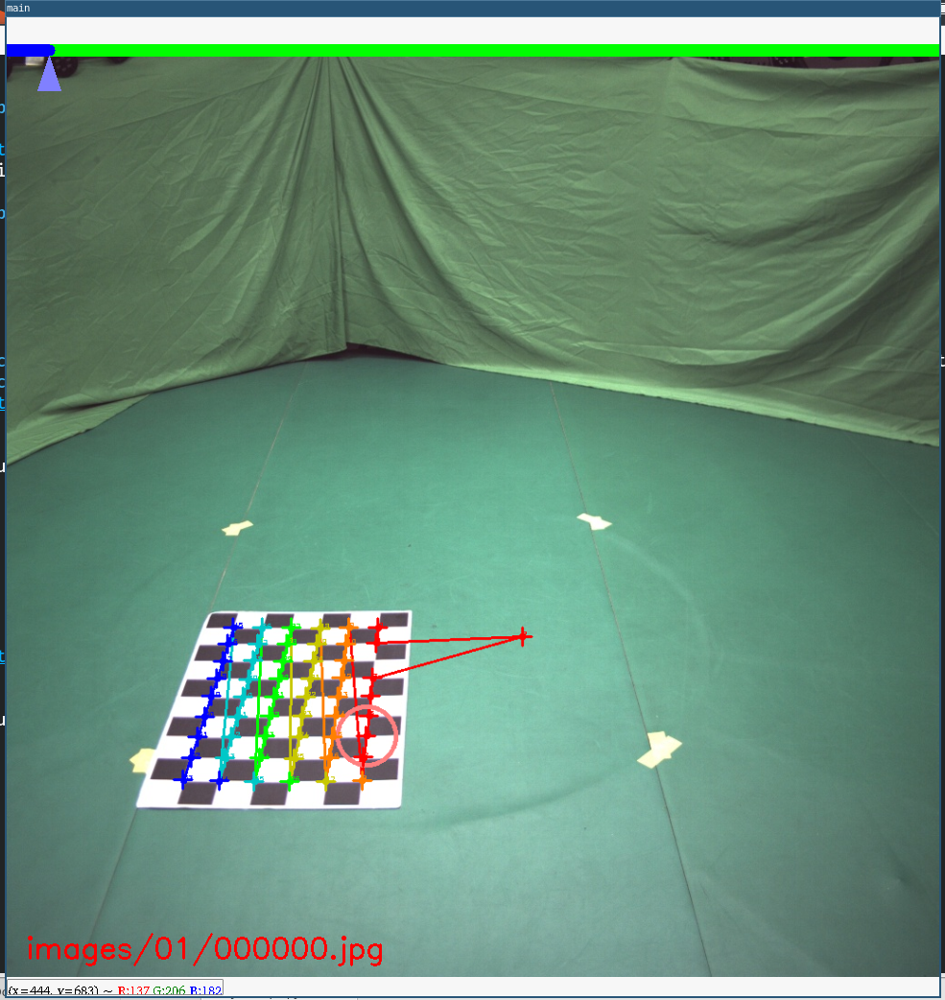
    <br>
    <sup>Press Space to move on to next point<sup/>
</div>

> Currently we only support move to next point. If you want to move to previous point, please `Space` for many times until it back to start.

If you're satisfied with this frame, you can press `D` move on to next frame.


<div align="center">
    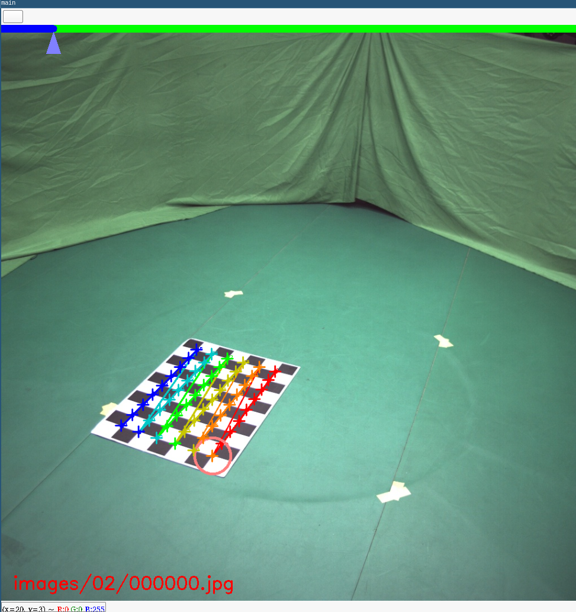
    <br>
    <sup>Press D to move on to next frame<sup/>
</div>


If you press `A`, you can move back to previous frame.

After finish annotating every frames, press `q` to quit.

<div align="center">
    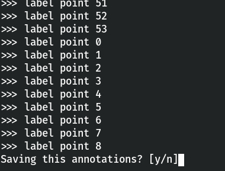
    <br>
    <sup>CLI prompt to save the result. Press Y to save and N to discard<sup/>
</div>

Then you can choose whether to save this annotation.

> If your data is on remote server, then the OpenCV GUI may be too slow to operate if you directly run the script via ssh X forwarding. We recommend you use `sshfs` to mount the remote data directory and locally run this script.


## 3. Intrinsic Parameter Calibration

After extracting chessboard, it is available to calibrate the intrinsic parameter.

```bash
python3 apps/calibration/calib_intri.py ${data} --step 5
```

After the script finishes, you'll get `intri.yml` under `${data}/output`.

> This step may take a long time, so please be patient. :-)

## 4. Extrinsic Parameter Calibration


Then you can calibrate the extrinsic parameter.

```
python3 apps/calibration/calib_extri.py ${extri} --intri ${intri}/output/intri.yml
```

After the script finished, you'll get `extri.yml` under `${intri}/output`.

## 5. (Optional)Bundle Adjustment

Coming soon

## 6. Check the calibration

To check whether your camera parameter is correct, we provide several approaches to make verification.

1. **Check the calibration results with chessboard:**
```bash
python3 apps/calibration/check_calib.py ${extri} --out ${intri}/output --vis --show
```

A window will be shown for checking.

<div align="center">
    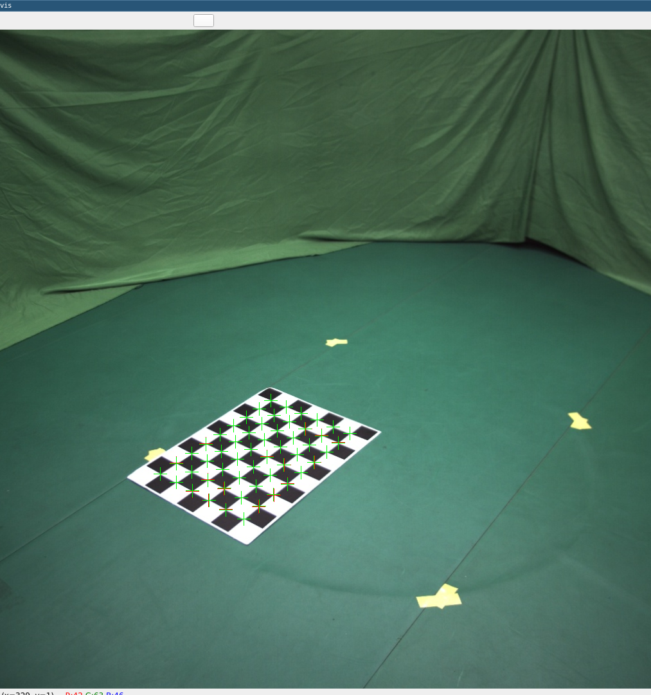
    <br>
    <sup>Use chessboard to check results<sup/>
</div>

**Check the results with a cube.**
```bash
python3 apps/calibration/check_calib.py ${data} --out ${data}/output --mode cube --write
```

You'll get results in `$data/output/cube`. 


<div align="center">
    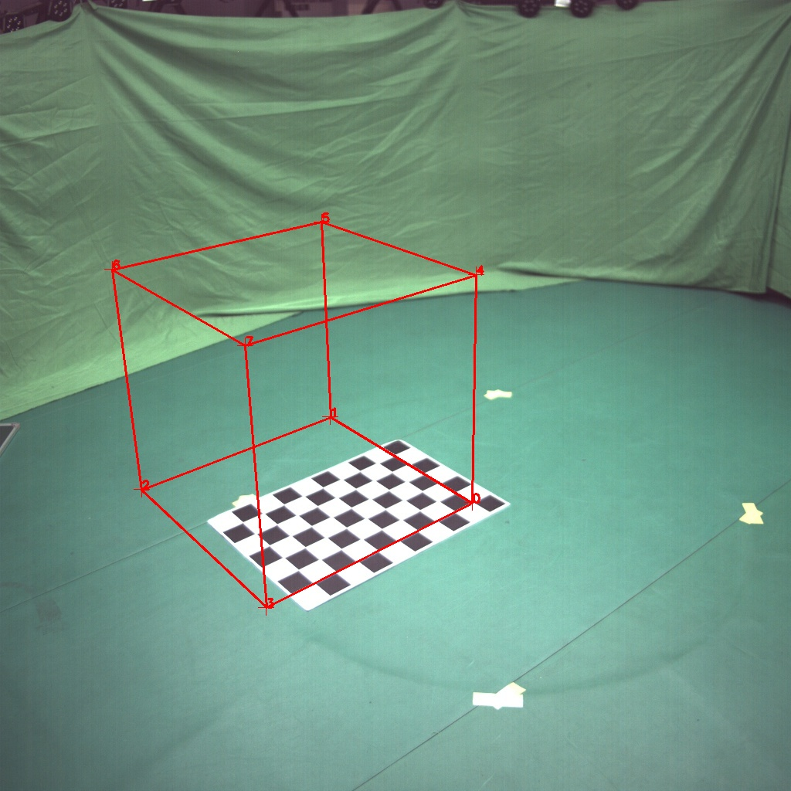
    <br>
    <sup>Use cube to check results<sup/>
</div>


2. (TODO) Check the calibration results with people.