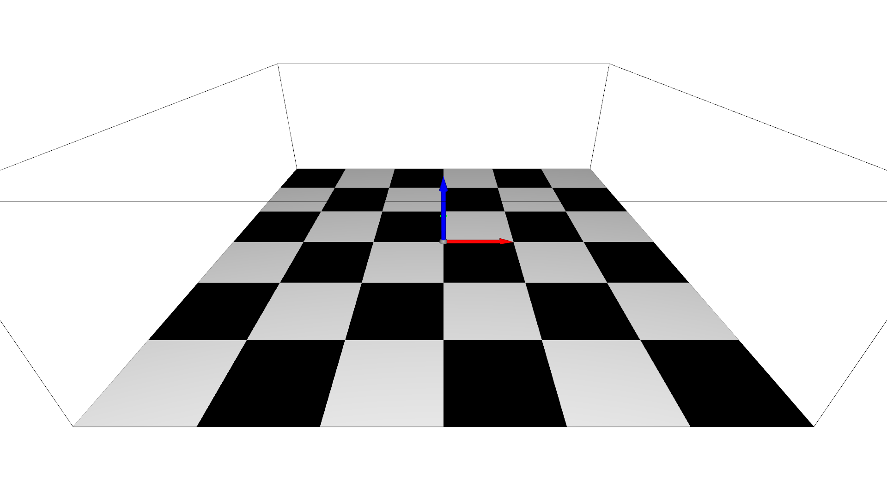
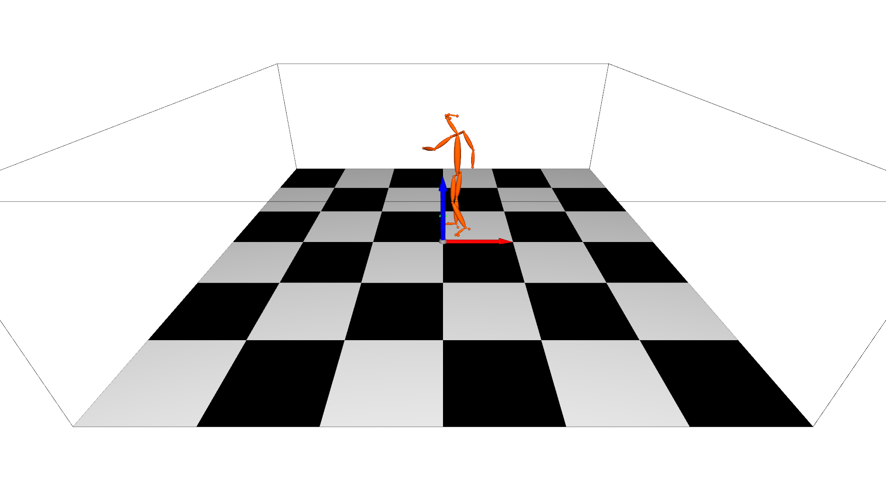

<!--
 * @Date: 2021-06-04 15:56:55
 * @Author: Qing Shuai
 * @LastEditors: Qing Shuai
 * @LastEditTime: 2021-06-28 13:56:41
 * @FilePath: /EasyMocapRelease/doc/realtime_visualization.md
-->
# EasyMoCap -> Real-time Visualization

We are the first one to release a real-time visualization tool for both skeletons and SMPL/SMPL+H/SMPL-X/MANO models.

## Install

Please install `EasyMocap` first. This part requires `Open3D==0.9.0`:

```bash
python3 -m pip install open3d==0.9.0
```

## Open the server
Before any visualization, you should run a server:

```bash
# quick start:
python3 apps/vis/vis_server.py --cfg config/vis3d/o3d_scene.yml
# If you want to specify the host and port:
python3 apps/vis/vis_server.py --cfg config/vis3d/o3d_scene.yml host <your_ip_address> port <set_a_port>
```

This step will open the visualization window:



You can alternate the viewpoints free. Press `a` to automatic rotate the scene.  The configuration file `config/vis/o3d_scene.yml` defines the scene and other properties. In the default setting, we define the xyz-axis in the origin, the bounding box of the scene and a chessboard in the ground.

## Send the data

If you are success to open the server, you can visualize your 3D data anywhere. We provide an example code:

```bash
python3 apps/vis/vis_client.py --path <path/to/your/keypoints3d> --host <previous_ip_address> --port <previous_port>
```

Take the `zju-ls-feng` results as example, you can show the skeleton in the main window:



## Embed this feature to your code

To add this visualization to your other code, you can follow these steps:

```bash
# 1. import the base client
from easymocap.socket.base_client import BaseSocketClient
# 2. set the ip address and port
client = BaseSocketClient(host, port)
# 3. send the data
client.send(data)
```

The format of data is:
```python
data = [
    {
        'id': 0,
        'keypoints3d': numpy.ndarray # (nJoints, 4) , (x, y, z, c) for each joint
    },
    {
        'id': 1,
        'keypoints3d': numpy.ndarray # (nJoints, 4)
    }
]
```

## Define your scene

In the configuration file, we main define the `body_model` and `scene`. You can replace them for your data.

## Examples

To understand our code, we provide lots of results for visualization.

First download the data [here](https://zjueducn-my.sharepoint.com/:u:/g/personal/s_q_zju_edu_cn/EQO5cILlYS1BgTT1ufDv2N4Bj41cvhstgmw_tMyi-6smWA?e=wSS9FB) and set the path to `vis`:

```bash
vis=/path/to/vis/data
```

### 1. Skeletons

Basic skeletons:

```bash
# Start the server:
python3 apps/vis/vis_server.py --cfg config/vis3d/o3d_scene.yml write True out ${vis}/output/skel-body25 camera.cz 3. camera.cy 0.5
# Send the keypoints:
python3 apps/vis/vis_client.py --path ${vis}/smpl/keypoints3d
```

<div align="center">
    
</div>

Body+Face+Hand:
```bash
# Start the server:
python3 apps/vis/vis_server.py --cfg config/vis3d/o3d_scene_total.yml write True out ${vis}/output/skel-total camera.cz 3. camera.cy 0.5
# Send the keypoints:
python3 apps/vis/vis_client.py --path ${vis}/smplx/keypoints3d
```

<div align="center">
    
</div>

Multiple Person:

```bash
# Start the server:
python3 apps/vis/vis_server.py --cfg config/vis3d/o3d_scene.yml write True out ${vis}/output/skel-multi camera.cz 3. camera.cy 0.5
# Send the keypoints:
python3 apps/vis/vis_client.py --path ${vis}/multi/keypoints3d --step 4
```

<div align="center">
    
</div>

### 2. Mesh

SMPL:
```bash
# Start the server:
python3 apps/vis/vis_server.py --cfg config/vis3d/o3d_scene_smpl.yml write True out ${vis}/output/mesh-smpl camera.cz 3. camera.cy 0.5
# Send the keypoints:
python3 apps/vis/vis_client.py --path ${vis}/smpl/smpl --smpl
```

<div align="center">
    
</div>

SMPLX:
```bash
# Start the server:
python3 apps/vis/vis_server.py --cfg config/vis3d/o3d_scene_smplx.yml write True out ${vis}/output/mesh-smplx camera.cz 3. camera.cy 0.5
# Send the keypoints:
python3 apps/vis/vis_client.py --path ${vis}/smplx/smpl --smpl
```

<div align="center">
    
</div>

MANO:
```bash
# Start the server:
python3 apps/vis/vis_server.py --cfg config/vis3d/o3d_scene_manol.yml write True out ${vis}/output/mesh-manol camera.cz 3. camera.cy 0.5
# Send the keypoints:
python3 apps/vis/vis_client.py --path ${vis}/manol/smpl --smpl
```

<div align="center">
    
</div>

## Advanced

### 1. Camera Setting

Try to modify these keys to control the location and rotation of the cameras.
```yml
camera:
  phi: 0
  theta: -30
  cx: 0.
  cy: 0.
  cz: 6.
```

### 2. Scene Setting

We provide some useful mesh in `easymocap.visualize.o3dwrapper`. If you want to add your own 3D mesh, add it to the key `scene`.

### 3. Body Model

At present, we just allow use one type of body model in the scene for fast visualization. So you must set the body model before you run the `apps/vis/vis_server.py`. If you want to use different models in a scene, you can implement it and pull a request.